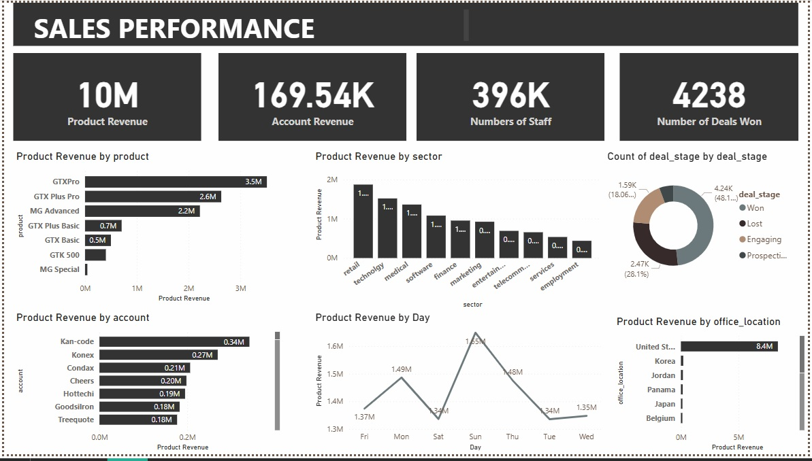

# Sales_Performance-
To develop insights and strategies to enhance sales performance by analyzing sales data across various products, sales teams, and market segments. 
---
## Key Questions to Address:
Sales Performance:
 - Which products generate the highest revenue, and in which sectors?
 - What is the revenue trend over time across different sectors and products? ⏲️
 - Which accounts (companies) have the highest deal values, and what characteristics do they share? 📊
---

##Insight 
GTXPro had the highest product revenue, which was 7,920.88% higher than MG Special, which had the lowest product revenue at 43768.
GTXPro accounted for 35.09% of Product Revenue.

Across all 7 products, Product Revenue ranged from 43768 to 3510578.
